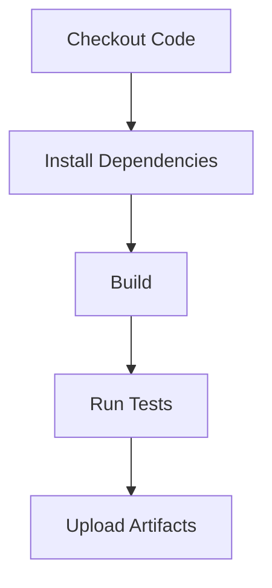

# CI/CD Documentation

## Overview
This document provides an overview of the CI/CD pipelines used in the `recipe-management-frontend` project. The pipelines are implemented using Buildkite for continuous integration and deployment.

---

## Buildkite Pipeline

### Pipeline Structure
The Buildkite pipeline is defined in the `pipeline.yml` file. It includes the following steps:

1. **Checkout Code**: Fetches the latest code from the repository.
2. **Install Dependencies**: Installs project dependencies using `npm ci`.
3. **Build**: Builds the project for production using `npm run build`.
4. **Run Tests**: Executes unit tests using `npm test`.
5. **Upload Artifacts**: Uploads build artifacts for further use.

### Diagram
Below is a diagram representing the Buildkite pipeline:

---

## Key Features
- **Node.js Environment**: The pipeline uses the `node:20` Docker image to ensure a consistent runtime environment.
- **Caching**: Dependencies are cached to speed up subsequent builds.
- **Artifact Management**: Build artifacts are uploaded for deployment or further testing.

---

## Future Improvements
- **Linting**: Currently removed from the pipeline. Plan to reintroduce after fixing local issues.
- **E2E Tests**: Add end-to-end tests using Playwright.
- **Deployment**: Automate deployment to staging and production environments.

---

## References
- [Buildkite Documentation](https://buildkite.com/docs)
- [Node.js Docker Images](https://hub.docker.com/_/node)

---

For any questions or issues, please contact the DevOps team.